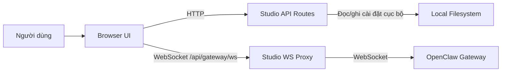

# Kiến trúc

## Tổng quan
VN AI Agent Office là ứng dụng Next.js gateway-first để hiển thị và vận hành các AI agent được hỗ trợ bởi OpenClaw sử dụng framework Three.JS.

Đây là lớp UI và proxy, không phải bản thân OpenClaw runtime. OpenClaw vẫn là hệ thống nguồn sự thật cho agent, session và thực thi, trong khi VN AI Agent Office cung cấp:

- không gian làm việc `/agents` cho chat, approval, cài đặt và giám sát runtime,
- môi trường 3D `/office` để không gian hóa hoạt động agent,
- giao diện `/office/builder` để chỉnh sửa office layout,
- lớp cài đặt và proxy phía Studio kết nối trình duyệt với OpenClaw gateway upstream.

## Mục tiêu
- Giữ OpenClaw là nguồn sự thật cho trạng thái runtime.
- Giữ trạng thái Studio cục bộ giới hạn ở các tùy chọn UI và cài đặt kết nối.
- Hỗ trợ cả cài đặt gateway cục bộ và từ xa.
- Duy trì ranh giới rõ ràng giữa code trình duyệt, code server và dữ liệu thuộc gateway.
- Ưu tiên các module tập trung vào tính năng hơn các abstraction chung lớn.

## Không phải mục tiêu
- Điều phối multi-user hoặc multi-tenant.
- Thay thế OpenClaw làm execution engine.
- Di chuyển trạng thái agent thuộc gateway vào local frontend storage.

## Mô hình hệ thống
VN AI Agent Office được chia thành bốn phần chính:

1. Browser UI.
   Client Next.js render không gian làm việc agents, văn phòng và builder.
2. Studio API routes.
   Các server route xử lý cài đặt cục bộ và các thao tác chỉ dành cho server.
3. Studio WebSocket proxy.
   Custom Node server terminate browser WebSocket connections tại `/api/gateway/ws` và chuyển tiếp chúng tới OpenClaw gateway upstream.
4. OpenClaw gateway.
   Gateway sở hữu agent records, session, config, approval và runtime event.

## Ranh giới cốt lõi
### 1. Trạng thái thuộc gateway
Agent records, session, approval, runtime stream và file agent thuộc về OpenClaw.

VN AI Agent Office có thể đọc và thay đổi trạng thái đó qua gateway API, nhưng không nên tạo ra nguồn sự thật cục bộ cạnh tranh.

### 2. Trạng thái cục bộ thuộc Studio
Studio lưu trữ các cài đặt cục bộ như:

- gateway URL và token,
- agent được tập trung và các tùy chọn UI liên quan,
- office layout và trạng thái hiển thị cục bộ.

Các cài đặt này nằm trong thư mục trạng thái VN AI Agent Office cục bộ và được truy cập qua server route, không trực tiếp từ trình duyệt.

### 3. Ranh giới client-server
Client component không nên đọc hoặc ghi local filesystem trực tiếp.

Bất cứ điều gì chạm đến file, cài đặt dựa trên môi trường hoặc SSH helper thuộc về phía server.

### 4. Ranh giới browser-gateway
Trình duyệt không kết nối trực tiếp tới upstream gateway. Nó kết nối với Studio qua same-origin WebSocket, và Studio mở kết nối upstream gateway trên server.

Điều này giữ upstream connection được quản lý bởi server và làm cho các cài đặt cục bộ, từ xa và tunnel dễ hỗ trợ hơn. UI hiện tại vẫn tải URL/token upstream đã cấu hình vào bộ nhớ trình duyệt lúc runtime, vì vậy trình duyệt vẫn là một phần của trust boundary đang hoạt động.

Điều này tránh sự lệch lạc giữa VN AI Agent Office và upstream runtime.

## Các luồng chính
### Luồng kết nối
1. UI tải Studio settings từ `/api/studio`.
2. Trình duyệt mở WebSocket tới `/api/gateway/ws`.
3. Studio proxy tải upstream gateway URL và token phía server.
4. Studio mở kết nối upstream gateway và chuyển tiếp frame giữa trình duyệt và gateway.

### Luồng agent runtime
1. UI kết nối qua Studio proxy và yêu cầu trạng thái gateway.
2. Runtime event stream từ gateway vào agents UI.
3. Không gian làm việc agents dẫn xuất chat, status, approval và summary từ event stream đó.
4. Office view dẫn xuất animation và room activity từ các runtime signal cơ bản tương tự.

### Luồng văn phòng
1. Văn phòng đăng ký trạng thái agent runtime.
2. Logic event-trigger chuyển đổi runtime activity thành các tín hiệu không gian.
3. Cảnh 3D render chuyển động agent, room activity và hành vi janitor/reset tạm thời từ trạng thái được dẫn xuất.

## Cấu trúc Repo
- `src/app`: route, layout và API endpoint.
- `src/features/agents`: agents workspace UI và xử lý trạng thái agent-runtime.
- `src/features/office`: màn hình office, panel và builder UI.
- `src/features/retro-office`: cảnh 3D, điều hướng, actor và rendering helper.
- `src/lib`: gateway adapter, Studio settings, logic dẫn xuất văn phòng và shared utility.
- `server`: custom Studio server và WebSocket proxy.

Để biết bản đồ code contributor thực tế và hướng dẫn mở rộng, xem `CODE_DOCUMENTATION.md`.

## Nguyên tắc thiết kế
- Gateway first.
  Nếu dữ liệu thuộc về runtime, nó nên nằm trong OpenClaw, không phải trong local frontend file.
- Trạng thái UI được dẫn xuất hơn là trạng thái bị sao chép.
  UI nên dẫn xuất view từ gateway event và local preference thay vì tạo các record song song.
- Tổ chức theo tính năng.
  Giữ hầu hết logic UI bên trong feature module và chỉ chuyển các utility thực sự chung vào `src/lib`.
- Ranh giới server hẹp.
  Truy cập filesystem, SSH helper và xử lý token nên ở phía server.
- Tài liệu kiến trúc ổn định.
  Tài liệu này nên mô tả ranh giới và ý định, không phải mọi helper, hook hoặc workflow file.

## Các quyết định quan trọng
- Cài đặt cục bộ dùng JSON-backed store thay vì database.
  Điều này giữ ứng dụng đơn giản và local-first, với chi phí là không hỗ trợ multi-user.
- Browser traffic đi qua same-origin Studio proxy thay vì trực tiếp tới gateway.
  Điều này thêm một hop, nhưng giữ credential phía server và cải thiện tính linh hoạt deployment.
- Cấu hình và file agent được quản lý qua gateway API.
  Điều này tránh sự lệch lạc giữa VN AI Agent Office và upstream runtime.
- Hành vi văn phòng được điều khiển từ trạng thái event được dẫn xuất thay vì các scene mutation bắt buộc.
  Điều này giữ lớp 3D có thể tái tạo và test được hơn.

## Ràng buộc
- Không lưu gateway token hoặc secret trong client-side persistent storage.
- Không đọc hoặc ghi local file từ client component.
- Không thêm nguồn sự thật thứ hai cho agent record bên ngoài gateway.
- Không ghi agent config thuộc gateway trực tiếp vào local OpenClaw config file.
- Không thêm Studio settings endpoint song song khi `/api/studio` đã sở hữu trách nhiệm đó.
- Không thêm abstraction nặng mà không có nhu cầu rõ ràng.

## Định hướng tương lai
- Nếu hỗ trợ multi-user trở nên quan trọng, thay thế local settings store bằng persistence layer dựa trên service và thêm authentication tại API boundary.
- Nếu gateway protocol thay đổi, giữ tác động bị cô lập bên trong `src/lib/gateway` và ranh giới Studio proxy.

Xem `KNOWN_ISSUES.md` để biết các lưu ý xuất bản hiện tại và các mục follow-up chưa giải quyết.

## Sơ đồ

