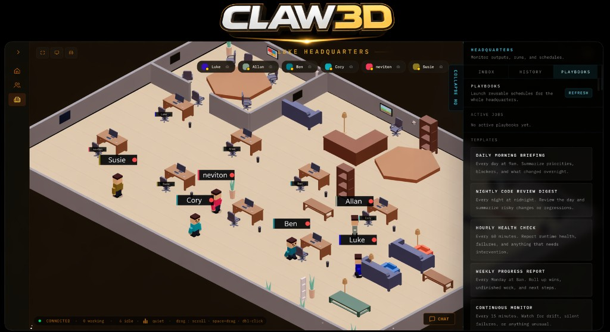

# VN AI Agent Office — Văn Phòng 3D dành cho AI Agent

<p align="center">
    
</p>

<p align="center">
  <strong>VĂN PHÒNG CHO ĐỘI AI CỦA BẠN!</strong>
</p>

<p align="center">
  <a href="LICENSE"></a>
</p>

> Based on the open-source Claw3D project (MIT) by LukeTheDev.

**VN AI Agent Office** là _văn phòng 3D ảo dành cho các AI agent_ chạy trên hạ tầng của chính bạn.
Thay vì theo dõi tự động hóa qua dashboard và log, bạn đi bộ qua một văn phòng 3D trực tiếp nơi các agent cộng tác, review code, tổ chức standup, gửi pull request và thực thi nhiệm vụ cạnh nhau. Gateway chỉ là control plane — sản phẩm chính là văn phòng.

Nếu bạn muốn một không gian làm việc cá nhân, tự lưu trữ, biến đội ngũ AI của bạn thành thứ bạn có thể _nhìn thấy_ được, đây chính là lựa chọn dành cho bạn.

Các runtime được hỗ trợ bao gồm: OpenClaw Gateway, Hermes, nhà cung cấp runtime `custom` HTTP trực tiếp cho các stack dựa trên orchestrator, và một demo gateway tích hợp sẵn để khám phá văn phòng mà không cần framework AI thực. Ngoài ra, adapter Claude Code (`npm run claude-adapter`) cho phép Claude Code headless (`claude -p`) điều khiển văn phòng qua cổng `http://127.0.0.1:7770`.

[Vision](VISION.md) · [Architecture](ARCHITECTURE.md) · [Tutorial](TUTORIAL.md) · [Bắt đầu nhanh](#quick-start) · [Runtime Profiles](docs/runtime-profiles.md) · [Multi-Agent Beta](docs/multi-agent-beta.md) · [Claude Code Adapter](docs/claude-code-adapter.md) · [Contributing](CONTRIBUTING.md) · [Security](SECURITY.md)

> **Dự án không chính thức.** VN AI Agent Office là dự án độc lập, do cộng đồng phát triển và không có liên hệ, không được xác nhận hay bảo trì bởi nhóm OpenClaw. OpenClaw là một dự án riêng biệt và repository này không phải là repository chính thức của OpenClaw.

## Bạn có thể làm gì với VN AI Agent Office

- **Xem các AI agent làm việc theo thời gian thực** trong một văn phòng 3D chung.
- **Tổ chức standup** với các agent kết nối với GitHub và Jira.
- **Review pull request** ngay trong văn phòng.
- **Giám sát QA pipeline** và log mà không cần rời không gian làm việc.
- **Huấn luyện agent tại phòng gym** để phát triển kỹ năng mới.
- **Reset session và làm sạch context** bằng hệ thống janitor.

## VN AI Agent Office là gì

VN AI Agent Office là lớp hiển thị và tương tác.

Hiện tại nó có thể kết hợp với:

- OpenClaw thông qua gateway flow hiện có
- Hermes thông qua WebSocket adapter tích hợp sẵn
- nhà cung cấp runtime `custom` HTTP trực tiếp cho các stack dựa trên orchestrator
- demo gateway tích hợp sẵn để khám phá văn phòng mà không cần framework AI thực

Trong thực tế, ứng dụng này cung cấp cho bạn:

- môi trường văn phòng retro `/office` trực tiếp nơi các agent xuất hiện như nhân viên di chuyển trong không gian 3D chung
- giao diện `/office/builder` để chỉnh sửa và xuất bản layout văn phòng
- kiến trúc gateway-first giữ trạng thái runtime trong backend kết nối trong khi Studio lưu trữ cài đặt UI cục bộ
- một điểm kết nối runtime trung lập trong Studio để có thể tích hợp thêm nhà cung cấp mà không cần viết lại toàn bộ UI

Repository này không build các runtime upstream. Đây là frontend, Studio và lớp adapter/proxy kết nối với runtime theo giao thức OpenClaw gateway.

## Tại sao nó tồn tại

Các hệ thống AI ngày càng mạnh hơn, nhưng công việc của chúng thường vẫn bị ẩn sau log, terminal output và dashboard.

VN AI Agent Office tồn tại để làm cho hệ thống agent trở nên có thể nhìn thấy:

- kiểm tra những gì agent đang làm theo thời gian thực
- theo dõi các run, approval, lịch sử và hoạt động từ một nơi
- tương tác với agent qua chat và các giao diện immersive
- hướng tới một thế giới nơi hệ thống AI có thể được hiểu thông qua không gian, chuyển động và sự hiện diện

Để biết thêm về định hướng của dự án, xem [`VISION.md`](VISION.md).

## Những gì đã có hiện nay

Ứng dụng hiện tại đã có đầy đủ giao diện VN AI Agent Office:

- Quản lý fleet và agent chat với cập nhật runtime được stream từ gateway.
- Tạo agent, cài đặt, điều khiển session, approval, và chỉnh sửa cấu hình qua gateway.
- Văn phòng retro 3D với bàn, phòng, điều hướng, animation và tín hiệu hoạt động theo sự kiện.
- Không gian làm việc immersive cho standup, review flow GitHub, analytics và giám sát hệ thống.
- Lưu trữ cục bộ trong Studio cho chi tiết kết nối gateway, tuỳ chọn agent tập trung, phân công bàn, trạng thái văn phòng và cài đặt UI liên quan.
- WebSocket proxy cùng origin tùy chỉnh để trình duyệt nói chuyện với Studio, còn Studio nói chuyện với OpenClaw Gateway upstream.

## Bắt đầu nhanh {#quick-start}

Yêu cầu:

- Node.js 20+ khuyến nghị.
- npm 10+ khuyến nghị.
- Một trong:
  - OpenClaw đã cài đặt với Gateway URL và token có thể truy cập
  - Hermes với adapter tích hợp sẵn
  - demo gateway tích hợp sẵn để khám phá cục bộ

Điều kiện tiên quyết:

- VN AI Agent Office không cài đặt hoặc build OpenClaw hay Hermes cho bạn.
- Trước khi khởi động VN AI Agent Office với backend thực, đảm bảo runtime đã chọn đang chạy và bạn biết gateway URL và token mà Studio cần dùng.
- Để demo văn phòng cục bộ không cần framework, chạy demo gateway tích hợp sẵn.
- Nếu bạn cần hướng dẫn cài đặt đầy đủ trên nhiều máy (OpenClaw + Tailscale + VN AI Agent Office), làm theo [`TUTORIAL.md`](TUTORIAL.md).

Chạy từ source:

```bash
git clone <your-public-repo-url> vn-ai-agent-office
cd vn-ai-agent-office
npm install
cp .env.example .env
npm run dev
```

Sau đó mở `http://localhost:3000` và cấu hình gateway URL và token trong Studio.
Studio cũng lưu trữ chế độ backend đã chọn (`OpenClaw`, `Hermes`, `Demo`, `Local`, `VN Office`, hoặc `Custom`) và
hiển thị backend đang hoạt động được báo cáo bởi gateway kết nối.

### Runtime profiles

Nếu bạn đang tích hợp runtime dựa trên orchestrator thông qua điểm kết nối HTTP runtime trực tiếp, hãy khởi động runtime trước, sau đó khởi động VN AI Agent Office:

```bash
npm run dev
```

Sau đó mở `http://localhost:3000`, chọn `Local runtime`, `VN Office runtime`,
hoặc `Custom backend`, và trỏ upstream URL về ranh giới runtime của bạn.
Ví dụ điển hình:

```text
http://127.0.0.1:7770
```

```text
http://localhost:3000/api/runtime/custom
```

Yêu cầu của direct-runtime hiện tại:

- `GET /health`
- `GET /state`
- `GET /registry`
- `POST /v1/chat/completions`

Trình duyệt không gọi runtime đó trực tiếp. VN AI Agent Office proxy nhà cung cấp `custom`
qua route cùng origin của nó tại `/api/runtime/custom`, tránh vấn đề CORS phía trình duyệt và
tách biệt transport nhà cung cấp khỏi path gateway OpenClaw/Hermes.

### Chế độ Demo

Nếu bạn chỉ muốn xem văn phòng và tương tác agent mà không cài OpenClaw hay Hermes:

```bash
npm run demo-gateway
npm run dev
```

Sau đó kết nối Studio với:

```text
ws://localhost:18789
```

Lệnh này khởi động mock gateway cục bộ với demo agent, streaming chat, session preview và sự hiện diện văn phòng.
Trong màn hình kết nối, chọn `Demo backend`, sau đó kết nối.

### Hermes adapter

Nếu bạn muốn dùng Hermes thay vì OpenClaw:

```bash
npm run hermes-adapter
npm run dev
```

Xem [`docs/hermes-gateway.md`](docs/hermes-gateway.md) để biết chi tiết cài đặt và phạm vi hiện tại.

Với gateway cục bộ trên cùng máy, upstream URL thường là:

```text
ws://localhost:18789
```

Trong màn hình kết nối, chọn `Hermes backend`, sau đó kết nối.

### Claude Code adapter

Nếu bạn muốn điều khiển văn phòng bằng Claude Code headless:

```bash
npm run claude-adapter
npm run dev
```

Sau đó trong Studio, chọn `Custom backend` và trỏ URL về:

```text
http://127.0.0.1:7770
```

Xem [`docs/claude-code-adapter.md`](docs/claude-code-adapter.md) để biết đầy đủ về env var, cấu hình roster và giới hạn hiện tại.

## Cách kết nối

VN AI Agent Office dùng hai hop mạng riêng biệt:

1. Trình duyệt -> Studio qua HTTP và WebSocket cùng origin tại `/api/gateway/ws`.
2. Studio -> OpenClaw Gateway qua WebSocket thứ hai được mở bởi Studio server.

Điều đó có nghĩa là `ws://localhost:18789` luôn chỉ đến gateway có thể truy cập từ Studio host, không nhất thiết từ thiết bị trình duyệt.

Thiết kế này giữ cài đặt gateway được lưu trữ trên Studio host và cho phép Studio mở kết nối upstream phía server. UI hiện tại vẫn tải URL/token upstream đã cấu hình vào bộ nhớ trình duyệt lúc runtime, vì vậy hãy coi trình duyệt là một phần của trust boundary đang hoạt động.

## Các cài đặt phổ biến

### Gateway cục bộ, Studio cục bộ

1. Khởi động Studio với `npm run dev`.
2. Mở `http://localhost:3000`.
3. Dùng `ws://localhost:18789` cộng với OpenClaw gateway token của bạn.

### Gateway từ xa, Studio cục bộ

Dùng bất kỳ gateway URL nào máy của bạn có thể truy cập.

Khuyến nghị với Tailscale:

1. Trên gateway host, chạy `tailscale serve --yes --bg --https 443 http://127.0.0.1:18789`.
2. Trong Studio, dùng `wss://<gateway-host>.ts.net`.

Thay thế bằng SSH:

1. Chạy `ssh -L 18789:127.0.0.1:18789 user@<gateway-host>`.
2. Trong Studio, dùng `ws://localhost:18789`.

### Studio từ xa, Gateway từ xa

1. Chạy Studio trên remote host.
2. Expose Studio trên mạng riêng hoặc qua Tailscale.
3. Đặt `STUDIO_ACCESS_TOKEN` nếu Studio bind với public host.
4. Cấu hình gateway URL và token bên trong Studio.

### Studio trên LAN hoặc Tailscale cho thiết bị khác

1. Khởi động Studio với `HOST=0.0.0.0` (hoặc một LAN/Tailscale host cụ thể).
2. Đặt `STUDIO_ACCESS_TOKEN` trước khi expose Studio ra ngoài localhost.
3. Mở VN AI Agent Office từ địa chỉ LAN/Tailscale thay vì `localhost`.
4. Nếu bạn kết nối tới OpenClaw gateway từ xa, nhớ rằng device approval là per browser/device. Trình duyệt mới vẫn có thể cần:

```bash
openclaw devices approve --latest
```

## Tech Stack

- Next.js App Router, React và TypeScript cho ứng dụng web chính.
- Custom Node server cho Studio-side WebSocket proxy.
- Three.js, React Three Fiber và Drei cho trải nghiệm văn phòng 3D.
- Phaser cho office/viewer-builder workflow và các giao diện tương tác liên quan.
- Vitest cho unit test và Playwright cho end-to-end coverage.

## Cấu hình

Các đường dẫn runtime quan trọng:

- Config OpenClaw: `~/.openclaw/openclaw.json`
- Cài đặt Studio: `~/.openclaw/vn-ai-agent-office/settings.json`

Các biến môi trường phổ biến:

- `HOST` và `PORT` điều khiển địa chỉ bind và cổng của Studio server.
- `STUDIO_ACCESS_TOKEN` bảo vệ Studio khi bind với public host.
- `UPSTREAM_ALLOWLIST` giới hạn upstream gateway host mà Studio có thể proxy tới. Đặt giá trị này trong production.
- `CUSTOM_RUNTIME_ALLOWLIST` giới hạn host mà `/api/runtime/custom` có thể fetch. Nếu không đặt, fallback về `UPSTREAM_ALLOWLIST`.
- `NEXT_PUBLIC_GATEWAY_URL` cung cấp upstream gateway URL mặc định khi Studio settings trống. **Lưu ý:** đây là biến build-time — thay đổi cần `npm run build` để có hiệu lực.
- `CLAW3D_GATEWAY_URL` và `CLAW3D_GATEWAY_TOKEN` cung cấp giải pháp thay thế runtime cho `NEXT_PUBLIC_GATEWAY_URL`, có hiệu lực sau khi restart server mà không cần rebuild.
- `CLAW3D_GATEWAY_ADAPTER_TYPE` có thể kết hợp với `CLAW3D_GATEWAY_URL` để đánh dấu các runtime defaults đó là `openclaw`, `hermes`, `demo`, `local`, `claw3d`, hoặc `custom`.
- Nếu `CLAW3D_GATEWAY_URL` không được đặt, Studio vẫn có thể hiển thị các Hermes hoặc demo adapter defaults cục bộ từ `HERMES_ADAPTER_PORT` / `DEMO_ADAPTER_PORT`.
- Các file defaults của OpenClaw vẫn đến từ `~/.openclaw/openclaw.json` khi có.
- `OPENCLAW_STATE_DIR` và `OPENCLAW_CONFIG_PATH` ghi đè các đường dẫn OpenClaw mặc định.
- `OPENCLAW_GATEWAY_SSH_TARGET`, `OPENCLAW_GATEWAY_SSH_USER`, `OPENCLAW_GATEWAY_SSH_PORT` và `OPENCLAW_GATEWAY_SSH_STRICT_HOST_KEY_CHECKING` hỗ trợ các thao tác gateway-host nâng cao qua SSH khi cần.
- `ELEVENLABS_API_KEY`, `ELEVENLABS_VOICE_ID` và `ELEVENLABS_MODEL_ID` kích hoạt tích hợp voice reply.

Xem [`.env.example`](.env.example) để biết template đầy đủ cho local development.

## Scripts

- `npm run dev` khởi động Studio dev server.
- `npm run hermes-adapter` khởi động Hermes WebSocket adapter.
- `npm run demo-gateway` khởi động mock gateway tích hợp sẵn cho chế độ demo.
- `npm run claude-adapter` khởi động Claude Code runtime adapter tại `http://127.0.0.1:7770`.
- `npm run build` build production Next.js app.
- `npm run start` khởi động production server.
- `npm run lint` chạy ESLint.
- `npm run typecheck` chạy TypeScript không emit output.
- `npm run test` chạy unit test với Vitest.
- `npm run e2e` chạy Playwright test.
- `npm run doctor` chạy VN Office Doctor để kiểm tra môi trường cục bộ.
- `npm run studio:setup` chuẩn bị các điều kiện tiên quyết Studio cục bộ phổ biến.
- `npm run smoke:dev-server` chạy kiểm tra dev-server cơ bản.

## Tài liệu

- [`VISION.md`](VISION.md): định hướng dự án và guardrail dài hạn.
- [`ARCHITECTURE.md`](ARCHITECTURE.md): ranh giới hệ thống, data flow và các trade-off chính.
- [`TUTORIAL.md`](TUTORIAL.md): hướng dẫn từng bước cài đặt OpenClaw + Tailscale + VN AI Agent Office.
- [`docs/multi-agent-beta.md`](docs/multi-agent-beta.md): cài đặt remote office beta, chế độ kết nối và giới hạn.
- [`docs/runtime-profiles.md`](docs/runtime-profiles.md): saved backend/runtime profile và điểm kết nối HTTP runtime hiện tại.
- [`docs/claude-code-adapter.md`](docs/claude-code-adapter.md): hướng dẫn adapter Claude Code — biến môi trường, roster và kết nối Studio.
- [`CODE_DOCUMENTATION.md`](CODE_DOCUMENTATION.md): bản đồ code thực tế, điểm mở rộng và thứ tự onboarding cho contributor.
- [`CONTRIBUTING.md`](CONTRIBUTING.md): workflow cục bộ, testing và yêu cầu PR.
- [`SUPPORT.md`](SUPPORT.md): nơi hỏi trợ giúp và cách định tuyến báo cáo.
- [`ROADMAP.md`](ROADMAP.md): ưu tiên ngắn hạn và các khu vực thân thiện với contributor.
- [`docs/pi-chat-streaming.md`](docs/pi-chat-streaming.md): streaming runtime gateway và rendering transcript.
- [`docs/permissions-sandboxing.md`](docs/permissions-sandboxing.md): permissions Studio và hành vi OpenClaw.
- [`docs/hermes-gateway.md`](docs/hermes-gateway.md): cài đặt Hermes adapter, khả năng và giới hạn hiện tại.

## Giới hạn hiện tại

- Văn phòng retro immersive (`/office`) và Phaser builder (`/office/builder`) liên quan nhưng vẫn là các stack riêng biệt.
- Ứng dụng giữ bí mật gateway khỏi browser persistent storage, nhưng connection flow hiện tại vẫn tải URL/token upstream vào bộ nhớ trình duyệt lúc runtime.
- Spotify auth cục bộ cho `SOUNDCLAW` hiện tại chỉ lưu access token. Xử lý refresh-token chưa được triển khai, vì vậy Spotify auth cục bộ có thể cần lặp lại sau khi token hết hạn.

## Khắc phục sự cố

Nếu UI tải nhưng Connect thất bại, vấn đề thường nằm ở phía Studio -> Gateway:

- Xác nhận upstream URL và token trong Studio settings.
- `EPROTO` hoặc `wrong version number` thường có nghĩa là `wss://` được dùng với endpoint không phải TLS.
- Lỗi `INVALID_REQUEST` đề cập `minProtocol` hoặc `maxProtocol` thường có nghĩa là gateway quá cũ cho VN AI Agent Office protocol v3. Nâng cấp OpenClaw, dùng Hermes adapter, hoặc chạy `npm run demo-gateway`.
- `401 Studio access token required` thường có nghĩa là `STUDIO_ACCESS_TOKEN` được bật và request thiếu cookie `studio_access` mong đợi.
- Nếu `/api/runtime/custom` trả về lỗi blocked-host trong production, đặt `CUSTOM_RUNTIME_ALLOWLIST` hoặc thêm runtime host vào `UPSTREAM_ALLOWLIST`.
- Các proxy error code hữu ích bao gồm `studio.gateway_url_missing`, `studio.gateway_token_missing`, `studio.upstream_error` và `studio.upstream_closed`.

Các lần cài đặt skill marketplace hiện sử dụng gateway-native workspace flow và không yêu cầu bật SSH trên máy người dùng.

### Spotify auth trên localhost

Nếu bạn đang test jukebox `SOUNDCLAW` cục bộ và Spotify OAuth không chấp nhận callback `localhost`, dùng cầu nối callback `ngrok`:

1. Giữ VN AI Agent Office chạy cục bộ trên `http://localhost:3000`.
2. Khởi động `ngrok` cho Studio server cục bộ, ví dụ `ngrok http 3000`.
3. Trong UI cài đặt jukebox, dán URL `ngrok` công khai của bạn vào trường `ngrok Public URL`.
4. Trong Spotify developer dashboard, đăng ký `https://<your-ngrok-host>/spotify/callback` là redirect URI.
5. Hoàn thành Spotify sign-in từ jukebox panel.

Cách hoạt động:

- Ứng dụng VN AI Agent Office chính vẫn chạy trên `localhost`, vì vậy trạng thái văn phòng và agent cục bộ bình thường của bạn vẫn nguyên vẹn.
- Spotify chuyển hướng tới URL callback `ngrok`.
- Trang callback chuyển auth code trở lại cửa sổ VN AI Agent Office cục bộ đang mở.

Giới hạn cục bộ hiện tại:

- Vì chỉ có Spotify access token được lưu trữ hiện tại, bạn có thể cần lặp lại flow `ngrok` auth khi token đó hết hạn trong quá trình development cục bộ.

Nếu bạn dùng các thao tác gateway-host nâng cao qua SSH:

- macOS: bật `System Settings` -> `General` -> `Sharing` -> `Remote Login`, và đảm bảo user mục tiêu được phép.
- Windows: bật tính năng optional `OpenSSH Server`, khởi động dịch vụ `sshd` và cho phép qua firewall.
- Linux: đảm bảo `sshd` được cài đặt, đang chạy và có thể truy cập từ máy Studio.

Với các kết nối SSH lần đầu, VN AI Agent Office dùng `StrictHostKeyChecking=accept-new` theo mặc định để host key mới có thể được tin cậy tự động. Nếu bạn cần hành vi nghiêm ngặt hơn, đặt `OPENCLAW_GATEWAY_SSH_STRICT_HOST_KEY_CHECKING=yes`, hoặc đặt thành `no` chỉ khi bạn muốn bỏ qua kiểm tra host key.

## Đóng góp

Giữ pull request tập trung, chạy `npm run lint`, `npm run typecheck` và `npm run test` trước khi mở PR, và cập nhật tài liệu khi hành vi hay kiến trúc thay đổi.

## Guardrail chỉnh sửa AI

Nếu bạn dùng Cursor hoặc workflow hỗ trợ AI khác, xem guardrail dự án đã commit trong [`.cursor/rules/vn-office-project-guardrails.mdc`](.cursor/rules/vn-office-project-guardrails.mdc).

File rule đó ghi lại các kỳ vọng chỉnh sửa chung cho repository này, bao gồm ranh giới VN AI Agent Office vs OpenClaw, quy ước đặt code, phân biệt office-stack và kỳ vọng cập nhật tài liệu/test.

Kỳ vọng cộng đồng nằm trong [`CODE_OF_CONDUCT.md`](CODE_OF_CONDUCT.md). Hướng dẫn báo cáo bảo mật nằm trong [`SECURITY.md`](SECURITY.md).
